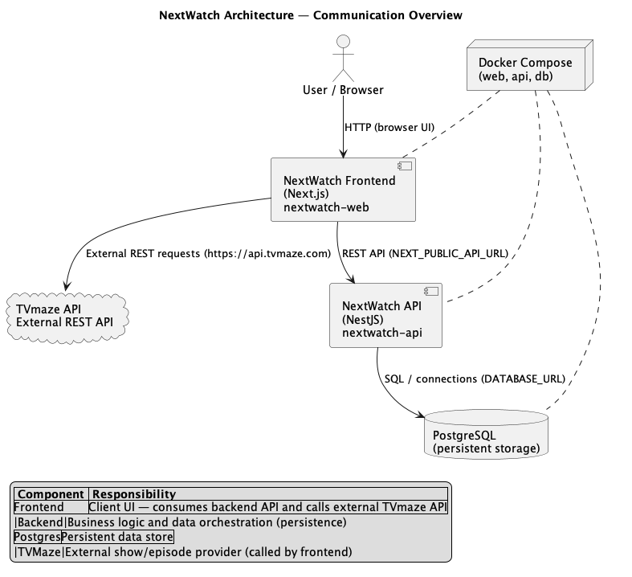

# NextWatch

NextWatch is a web application that allows users to track their favorite TV shows. It integrates with the TVMaze API to fetch show details and provides a user-friendly interface for managing watchlists.

## Table of Contents

- [NextWatch](#nextwatch)
  - [Table of Contents](#table-of-contents)
- [Getting Started](#getting-started)
  - [Prerequisites](#prerequisites)
  - [Installation](#installation)
  - [Running Without Docker](#running-without-docker)
    - [Backend](#backend)
    - [Frontend](#frontend)
  - [Features](#features)
  - [Technologies Used](#technologies-used)
  - [Architecture](#architecture)
    - [Communication summary](#communication-summary)
    - [Diagram](#diagram)

# Getting Started

## Prerequisites

- Docker and Docker Compose installed on your machine
- An internet connection to access the TVMaze API
- (Optional) Node.js and npm/yarn if you want to run the services without Docker

## Installation

1. Clone the repository:
   ```bash
   git clone https://github.com/robertheory/nextwatch.git
   cd nextwatch
   ```
2. Create a `.env` file in the root directory and add the necessary environment variables. You can refer to the `.env.example` file for guidance.
3. Build and start the services using Docker Compose:
   ```bash
   docker-compose up --build
   ```
4. Access the application at `http://localhost:3000`.
5. The backend API will be available at `http://localhost:3333`.
6. The PostgreSQL database will be accessible at `localhost:5432` with the credentials specified in your `.env` file.

## Running Without Docker

### Backend

1. Navigate to the `nextwatch-api` directory and install dependencies:
   ```bash
   cd nextwatch-api
   yarn install
   ```
2. Create a `.env` file in the `nextwatch-api` directory and add the necessary environment variables.
3. Instantiate a PostgreSQL database (locally or via a service like Docker) and ensure it is running.
4. Initialize the database and run migrations.
   ```bash
    npx prisma generate
    npx prisma migrate dev
   ```
5. Start the backend server:
   ```bash
   yarn start:dev
   ```
6. Access OpenAPI documentation at `http://localhost:3333/api`

### Frontend

1. Navigate to the `nextwatch-frontend` directory and install dependencies:
   ```bash
   cd nextwatch-frontend
   yarn install
   ```
2. Create a `.env` file in the `nextwatch-frontend` directory and add the necessary environment variables.
3. Start the frontend development server:
   ```bash
   yarn dev
   ```
4. Access the application at `http://localhost:3000`.

## Features

- View a list of tracked TV shows
- See detailed information about each show
- Track the status of each show (e.g., Watching, Completed)
- Responsive design for various devices
- Dockerized for easy deployment
- Integration with an external API (TVMaze)
- Componentized architecture with separate frontend and backend services
- Data persistence using PostgreSQL
- Comprehensive documentation and testing

## Technologies Used

- Frontend: Next.js, React, TypeScript
- Backend: NestJS, TypeScript
- Database: PostgreSQL
- Containerization: Docker, Docker Compose
- External API: TVMaze (reference in [docs/external-api.md](docs/external-api.md))
- Entities: domain & DB mapping (reference in [docs/entities.md](docs/entities.md))

## Architecture

The project follows a small service-oriented layout with a single frontend client and a backend API that persists data to PostgreSQL. The frontend (Next.js) is responsible for interacting with both the backend API and the external TVmaze REST API.

- **Frontend**: `nextwatch-web` (Next.js) — serves the browser UI, calls the backend API (`NEXT_PUBLIC_API_URL`) and performs direct requests to TVmaze for show/episode data.
- **Backend API**: `nextwatch-api` (NestJS) — provides application endpoints, orchestrates persistence and business logic, and exposes the REST API consumed by the frontend.
- **Database**: PostgreSQL — persistent storage for tracked shows and watched episodes.
- **External API**: TVmaze — public provider of show and episode metadata; the frontend calls TVmaze endpoints directly.
- **Infrastructure**: Docker Compose is used to run frontend, backend and database containers for development and deployment.

### Communication summary

- Browser → Frontend (HTTP)
- Frontend → Backend (REST API via `NEXT_PUBLIC_API_URL`)
- Frontend → TVmaze (external REST requests to `https://api.tvmaze.com`)
- Backend → PostgreSQL (SQL connections via `DATABASE_URL`)

### Diagram

The system architecture was modelled with PlantUML (source: `docs/architecture.puml`). A rendered image generated from that PlantUML source is included below.



If you need the PlantUML source, see `docs/architecture.puml`.
