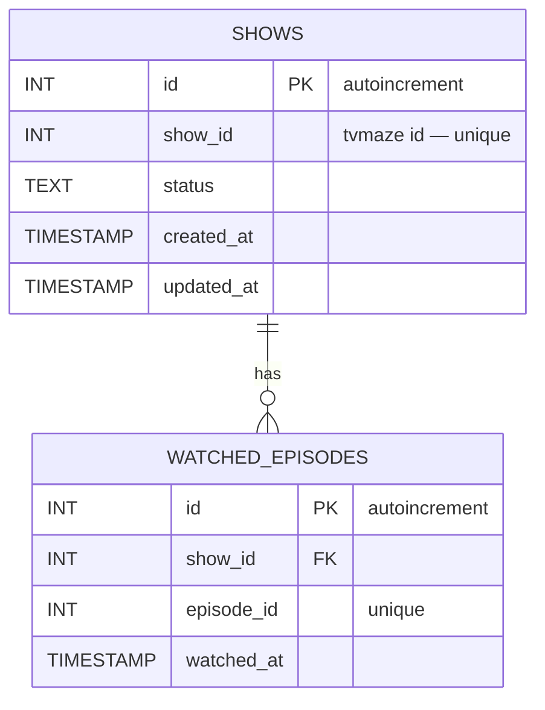

# Entities — Logical and Physical Mapping

This document provides a concise overview of the main domain entities used in NextWatch, how they relate at a logical level, and how those logical entities are persisted in the database (physical mapping). A mermaid ER diagram (DER) is included for quick visualization.

**Logical Entities**

- **Show**: Represents a TV show tracked by the user. Core responsibilities:

  - Identity: external TVMaze identifier (`showId`) used to resolve metadata.
  - Metadata: name, genres, premiered date, summary, image(s). (Note: metadata is not stored in the database; it is fetched from TVMaze as needed.)
  - Tracking state: a `status` with semantic values that describe user progress (NOT_STARTED, WATCHING, FINISHED, UNTRACKED).
  - Relationships: a `Show` can have many `WatchedEpisode` entries (one-to-many).

- **WatchedEpisode**: A record representing that a single episode (identified by an `episodeId`) was watched for a specific `Show`.

  - Attributes: `episodeId`, optional `watchedAt` timestamp.
  - Relationship: belongs to one `Show` and is constrained to be unique per show+episode pair.

- **ShowStatus (enum)**: Logical enumeration describing user state for a show:
  - `NOT_STARTED` — the user hasn't started watching
  - `WATCHING` — currently watching
  - `FINISHED` — finished the show
  - `UNTRACKED` — present in UI but not tracked

**Physical (Database) Mapping — Prisma models**
The current Prisma schema (see `prisma/schema.prisma`) maps the logical entities to concrete tables and columns. Key details:

- **Table: `shows`** (Prisma model `Show`)

  - `id` (Int, PK, autoincrement) — internal surrogate key.
  - `show_id` (Int, unique) — external TVMaze show id (mapped in code as `showId`).
  - `status` (Text) — persisted string representing `ShowStatus`.
  - `created_at`, `updated_at` (Timestamps) — audit timestamps; `updated_at` is `@updatedAt`.
  - Relation: has many `watched_episodes`.

- **Table: `watched_episodes`** (Prisma model `WatchedEpisode`)
  - `id` (Int, PK, autoincrement) — internal surrogate key.
  - `show_id` (Int) — FK referencing `shows.show_id` (note: relation is made to `showId` field in `shows`).
  - `episode_id` (Int, unique) — external episode id (unique constraint at DB level).
  - `watched_at` (Timestamp, nullable) — when the episode was watched.
  - Constraints: `@@unique([showId, episodeId])` ensures an episode is recorded at most once per show.
  - Foreign key behavior: `onDelete: Cascade` — deleting a `Show` will cascade and remove related `WatchedEpisode` rows.

**Important constraints and invariants**

- `shows.show_id` is unique — the system treats the TVMaze id as the logical external identifier.
- There is a combined uniqueness on `(showId, episodeId)` in `watched_episodes` to prevent duplicate watch records for the same episode within a show.
- `status` is stored as plain text in DB; application layer converts to/from the `ShowStatus` enum. This gives flexibility but requires application-level validation.

**Mermaid ER Diagram (DER)**

**How entities are used in the application**

- The frontend resolves metadata from TVMaze (by `showId`) and merges that external data with local tracking state (`status`) provided by the backend API.
- The backend persists only the minimal tracking data (`showId`, `status`, watched episodes) while the richer show metadata (summary, images, genres) is retrieved from TVMaze on demand and cached client-side when appropriate.
